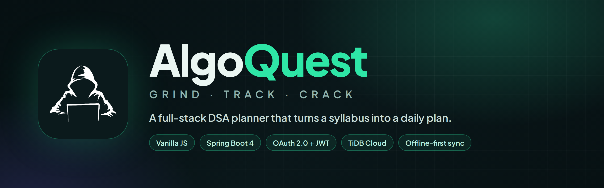
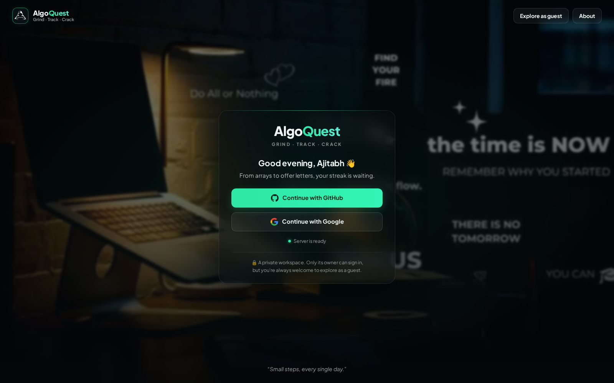
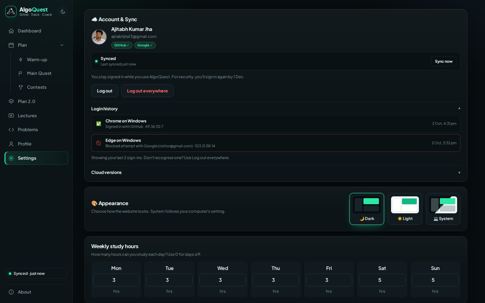
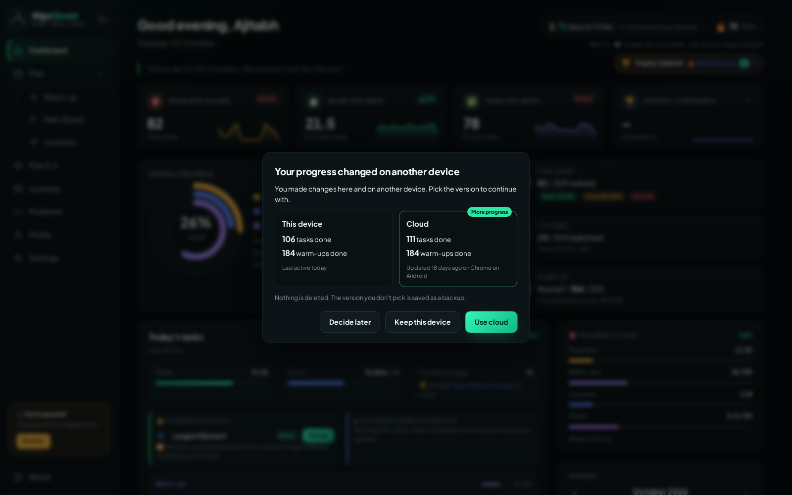
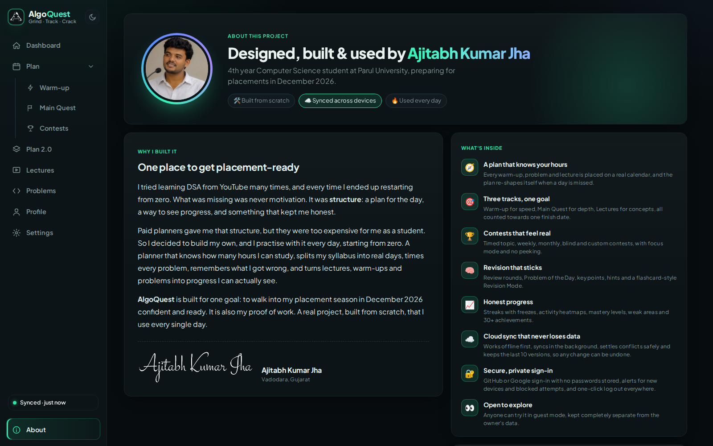
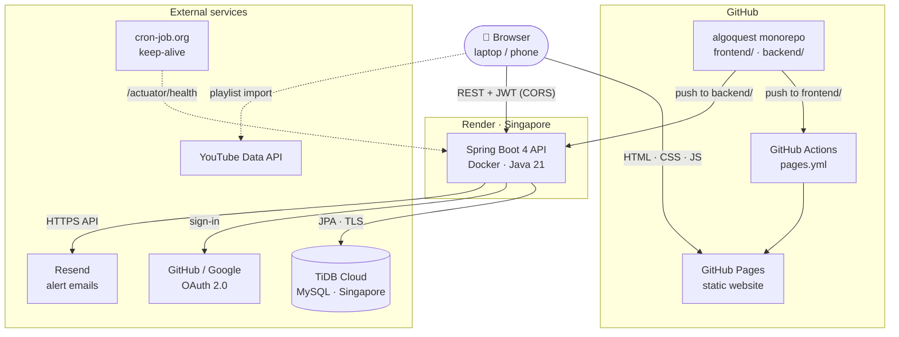
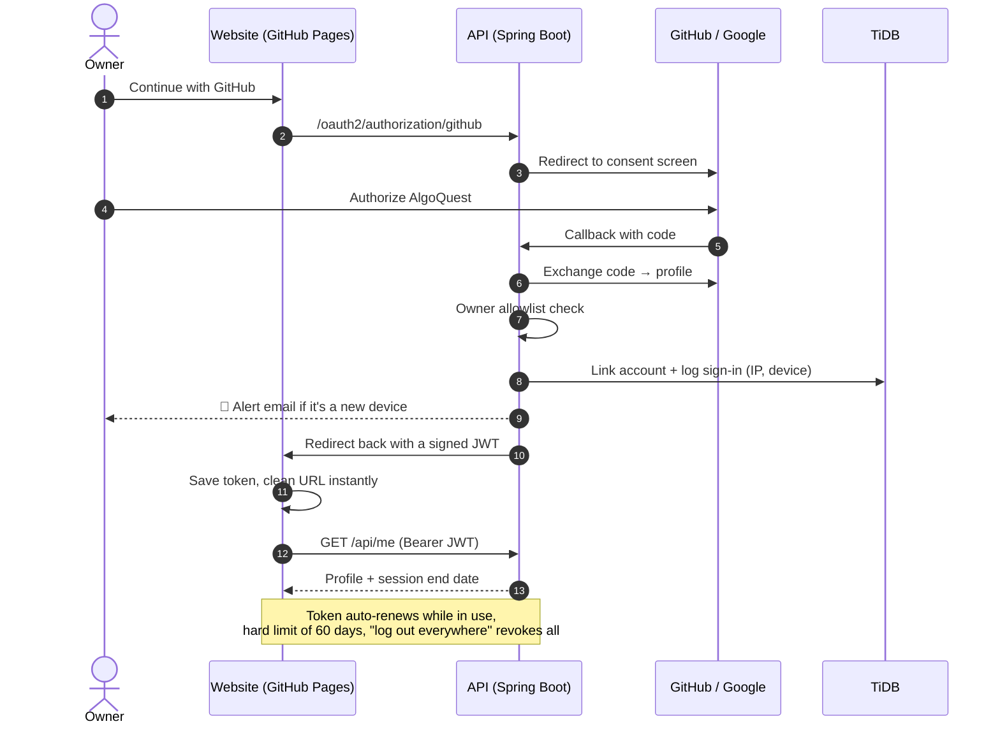
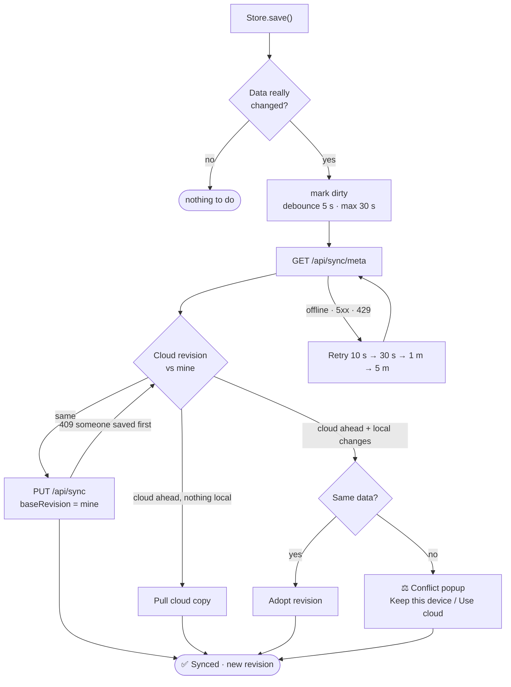

<div align="center">



<br>

**A full-stack, offline-first DSA planner that turns lectures, warm-ups and problems into a day-by-day plan,<br>syncs across devices, and keeps me honest until placement day.**

<br>

[](https://ajitabhjha13.github.io/algoquest/)
&nbsp;
[](https://algoquest-api-45ay.onrender.com/api/hello)
&nbsp;
[](https://github.com/Ajitabhjha13/algoquest/actions)

<br>


-DC150B?style=flat-square&logo=tidb&logoColor=white)


<br>


<sub>Screenshots use demo data.</sub>

</div>

<br>

## 📑 Contents

[Why I built it](#-why-i-built-it) · [Highlights](#-highlights) · [Screenshots](#-screenshots) · [Architecture](#%EF%B8%8F-architecture) · [Sign-in flow](#-sign-in-flow) · [Sync engine](#-sync-engine) · [Scheduler](#%EF%B8%8F-how-the-scheduler-works) · [Security](#-security) · [Tech stack](#%EF%B8%8F-tech-stack) · [Project structure](#-project-structure) · [Run locally](#-run-it-locally) · [Deployment](#-deployment)

---

## 💡 Why I built it

I tried learning DSA from YouTube many times, and every time I ended up restarting from zero. What was missing was never motivation. It was **structure**: a plan for the day, a way to see progress, and something that kept me honest.

Paid planners gave me that structure, but they were too expensive for me as a student. So I built my own, from scratch. AlgoQuest knows how many hours I can study, splits my syllabus into real days, times every problem, remembers what I got wrong, and shows me exactly how close I am to being placement-ready. Then I gave it a Spring Boot backend so my progress follows me from laptop to phone.

**I use it every day.**

---

## ✨ Highlights

<table>
<tr>
<td width="50%" valign="top">

### 🧭 A plan that knows your hours
A **greedy scheduler** places every warm-up, problem and lecture on a real calendar based on your hours per weekday. Miss a day and the plan re-shapes itself. After 15 timed problems it learns your speed and adjusts the whole plan.

</td>
<td width="50%" valign="top">

### 🎯 Three tracks, one goal
⚡ **Warm-up**: 322 coding-round questions in shuffled rounds<br>
🚩 **Main Quest**: 329 core problems (Striver A2Z + Love Babbar + roadmap, de-duplicated)<br>
🎬 **Lectures**: a YouTube playlist split into weekly sprints

</td>
</tr>
<tr>
<td valign="top">

### ☁️ Offline-first cloud sync
Works without internet, syncs in the background, **never loses data**: optimistic locking, conflict popup, safety copies and the last 10 versions with one-click restore (and undo).

</td>
<td valign="top">

### 🔐 Secure, private sign-in
GitHub or Google OAuth 2.0, **no passwords stored**, owner-only allowlist, sliding JWT sessions, new-device and blocked-attempt email alerts, and *log out everywhere*.

</td>
</tr>
<tr>
<td valign="top">

### 🏆 Contests that feel real
Topic, weekly, monthly, speed and grand contests plus a custom designer. **Focus mode**, no peeking, **blind mode**, and a confidence meter with history.

</td>
<td valign="top">

### 📈 Honest progress
KPI sparklines, progress rings, streaks with a weekly ❄️ freeze, heatmaps, topic mastery, weak-area detection and **35 achievements** in a trophy cabinet.

</td>
</tr>
<tr>
<td valign="top">

### 🧠 A question panel for every problem
166 full LeetCode statements, your own hidden solution, step-by-step hints, key points, notes, a timer and one-click review marking.

</td>
<td valign="top">

### 👀 Open to explore
Anyone can try it in **guest mode**, a separate sandbox that never touches the owner's data and never leaves the visitor's browser.

</td>
</tr>
</table>

---

## 📸 Screenshots

<table>
<tr>
<td width="50%"><b>Sign in</b><br></td>
<td width="50%"><b>Light mode</b><br></td>
</tr>
<tr>
<td><b>Main Quest</b><br></td>
<td><b>Question panel</b><br></td>
</tr>
<tr>
<td><b>Lectures in sprints</b><br></td>
<td><b>Warm-up rounds</b><br></td>
</tr>
<tr>
<td><b>Contests</b><br></td>
<td><b>Problems library</b><br></td>
</tr>
<tr>
<td><b>Account, sync &amp; login history</b><br></td>
<td><b>Conflict-safe sync</b><br></td>
</tr>
<tr>
<td><b>Profile</b><br></td>
<td><b>About</b><br></td>
</tr>
</table>

<p align="center"><b>📱 On the phone</b><br></p>

---

## 🏗️ Architecture



| Part | Where it runs | Notes |
|---|---|---|
| **Frontend** | GitHub Pages (auto-deployed by GitHub Actions) | Vanilla JS single-page app, hash router, offline-first in `localStorage` |
| **Backend** | Render free tier, Singapore (Docker) | Stateless JWT REST API + session-based OAuth login chain |
| **Database** | TiDB Cloud Starter, Singapore | MySQL-compatible, serverless, auto-wakes, free |
| **Keep-alive** | cron-job.org | Pings `/actuator/health` every 10 min, 9 AM to 2 AM IST |

> The whole stack costs **₹0** a month.

---

## 🔑 Sign-in flow



A visitor who is not on the allowlist is sent back to the login screen with a friendly *"This is a private planner"* message, the attempt is logged, and the owner gets an email.

---

## 🔄 Sync engine

Every save is local first. The sync engine (`frontend/js/sync.js`) wraps `Store.save()` and pushes changes to the cloud a few seconds later.



- **Optimistic locking**: every save carries `baseRevision`; the database only accepts it if nobody saved in between (`UPDATE ... WHERE revision = ?`).
- **No data loss**: before anything is overwritten, the losing side is kept (a local safety copy or a cloud version). The last 10 versions can be restored, and a restore is itself undoable.
- **Multi-tab safe**, idempotent saves, retry with backoff, and a status that is always visible: sidebar on laptop, a coloured dot on phone.

---

## ⚙️ How the scheduler works

The heart of AlgoQuest is a **greedy day-filling scheduler** (`frontend/js/scheduler.js`):

1. Every pending item gets a time estimate: problems by topic and difficulty, lectures by `video length ÷ playback speed × study multiplier`, warm-ups at 5 minutes each.
2. Starting from today, each day's capacity is `hours for that weekday × 60` minutes.
3. Warm-ups are placed first. The remaining time is split between lectures and Main Quest using a configurable share, and each track is filled **in order** until its budget runs out.
4. When one track finishes, its time goes to the other. When everything is placed, the last day is the projected finish date.

Because the plan is always rebuilt from **today**, a missed day needs no special handling. Today's list is locked once generated, so ticking a task never reshuffles the day.

Other algorithms inside: **Fisher–Yates shuffle** with balanced buckets for warm-up rounds, **weighted random selection** for contest questions, a **median-ratio speed factor** to calibrate estimates, a **token bucket** rate limiter on the API, and **Catmull–Rom curves** for hand-drawn SVG charts.

---

## 🛡️ Security

| Layer | What it does |
|---|---|
| **OAuth 2.0 only** | No passwords are ever stored. GitHub and Google accounts both map to one owner. |
| **Allowlist** | Only the owner's GitHub login and email can sign in. |
| **JWT (HS256)** | Stateless API, 7-day token that renews while in use, 60-day absolute limit, token version for *log out everywhere*. |
| **Two security chains** | `/api/**` is stateless (no session cookie). Only the OAuth handshake uses a short session. |
| **CORS** | Only the website's origins can call the API. |
| **Rate limiting** | Token bucket per IP: 10/min on login, 60/min on the API. Real client IP read from Cloudflare headers, so spoofed `X-Forwarded-For` can't bypass it. |
| **Alerts** | Email on a new device and on blocked sign-in attempts, with a spam guard. |
| **Secrets** | Never in Git: local `secrets.properties` (git-ignored) and Render environment variables in production. |

---

## 🛠️ Tech stack

| Layer | Choice | Why |
|---|---|---|
| UI | HTML, CSS (design tokens, dark / light / system), Vanilla JavaScript | No framework, so every line is mine to explain |
| Routing | Hash-based single-page app | Works on any static host |
| Charts | Hand-written SVG | No chart library needed |
| Backend | Java 21, Spring Boot 4, Spring Security, OAuth2 Client, Resource Server (JWT), Spring Data JPA, Hibernate 7 | Industry-standard, strongly typed |
| Database | TiDB Cloud Starter (MySQL-compatible) | Free, serverless, never needs a manual "power on" |
| Email | Resend HTTPS API | Render's free tier blocks SMTP ports |
| DevOps | Docker (multi-stage), Render, GitHub Actions, GitHub Pages, cron-job.org | Free, automatic deploys on every push |
| Data | Striver A2Z, Love Babbar 450, LeetCode dataset, YouTube Data API v3 | Real content, de-duplicated |

---

## 📁 Project structure

```
algoquest/
├── frontend/                    # Website (GitHub Pages)
│   ├── index.html               # App shell: sidebar + main area
│   ├── privacy.html             # Privacy policy
│   ├── css/
│   │   ├── style.css            # Design tokens, themes, components
│   │   └── cloud.css            # Login, account, sync, popups
│   ├── data/                    # 522 problems · 322 warm-ups · 166 statements
│   └── js/
│       ├── store.js             # State + localStorage (owner / guest)
│       ├── api.js · auth.js     # REST client, sign-in, auto-renew
│       ├── sync.js              # Offline-first sync engine
│       ├── scheduler.js         # Greedy day-by-day planner
│       ├── tracker.js           # Done / timer / streaks / daily log
│       ├── contest.js · insights.js · analytics.js
│       ├── ui.js · modal.js     # Tooltips, popovers, popups
│       └── pages/               # One file per page
├── backend/                     # Spring Boot API (Render) · see backend/README.md
│   ├── Dockerfile
│   └── src/main/java/com/ajitabh/algoquest/
│       ├── config/              # Typed app properties
│       ├── controller/          # Me, Sync, LoginHistory, Hello
│       ├── model/ · repository/ # JPA entities and repositories
│       ├── security/            # Security chains, JWT, OAuth, CORS, rate limit
│       └── service/             # Sync, audit, alerts, owner account
├── docs/                        # README images
└── .github/workflows/pages.yml  # Deploys frontend/ to GitHub Pages
```

---

## 🚀 Run it locally

**Frontend**

```bash
git clone https://github.com/Ajitabhjha13/algoquest.git
cd algoquest
```
Open the folder in VS Code, start **Live Server**, and visit `http://localhost:5500/frontend/`. The site works on its own in guest mode.

**Backend** (needs Java 21+ and a MySQL-compatible database)

```bash
cd backend
cp secrets.properties.example secrets.properties   # fill in DB, OAuth, JWT and Resend values
./mvnw spring-boot:run                               # Windows: .\mvnw.cmd spring-boot:run
```
The API starts on `http://localhost:8080`. See [`backend/README.md`](backend/README.md) for every endpoint and setting.

**Lectures:** create a free YouTube Data API v3 key, restrict it to your site's address, and paste it on the Lectures page. It is stored only in your browser.

---

## ☁️ Deployment

| What | How |
|---|---|
| Website | Every push that touches `frontend/` runs `.github/workflows/pages.yml`, which publishes the folder to GitHub Pages. |
| API | Render builds `backend/Dockerfile` (Maven build stage → slim Java 21 runtime) on every push that touches `backend/`. Health check: `/actuator/health`. |
| Secrets | Render environment variables. A separate production OAuth app and JWT secret keep local and live environments apart. |
| Uptime | Render's free tier sleeps after 15 idle minutes. A cron job keeps it awake during my study hours, and the offline-first website keeps working while it wakes up. |

---

## 🗺️ Roadmap

- [x] Planner, scheduler and three tracks
- [x] Contests, analytics and achievements
- [x] UI makeover with light mode and mobile layout
- [x] Spring Boot backend with GitHub / Google sign-in
- [x] Offline-first sync across laptop and phone, with versions and conflict handling
- [x] Monorepo with CI/CD (GitHub Actions + Render)
- [ ] Unit tests for the sync service and rate limiter
- [ ] Installable app (PWA)
- [ ] Spaced repetition for revision

---

<div align="center">

### 👤 Author

**Ajitabh Kumar Jha**<br>
4th year CSE · Parul University · Vadodara, Gujarat

[](https://github.com/Ajitabhjha13)
[](https://www.linkedin.com/in/ajitabh-kumar-jha-476546283)
[](https://leetcode.com/u/ajitabhjha13/)
[](https://ajitabh-portfolio.vercel.app/)

<picture>
  <source media="(prefers-color-scheme: dark)" srcset="docs/signature-white.png">
  
</picture>

*Designed, built and used by me. Made with patience, chai and a lot of late nights.* ☕

</div>
