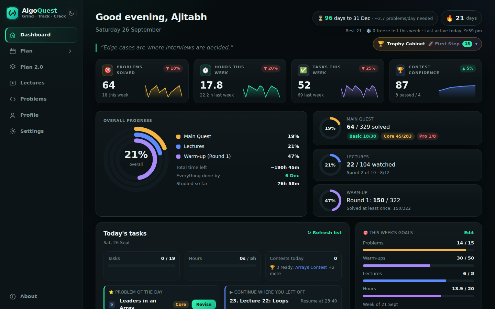
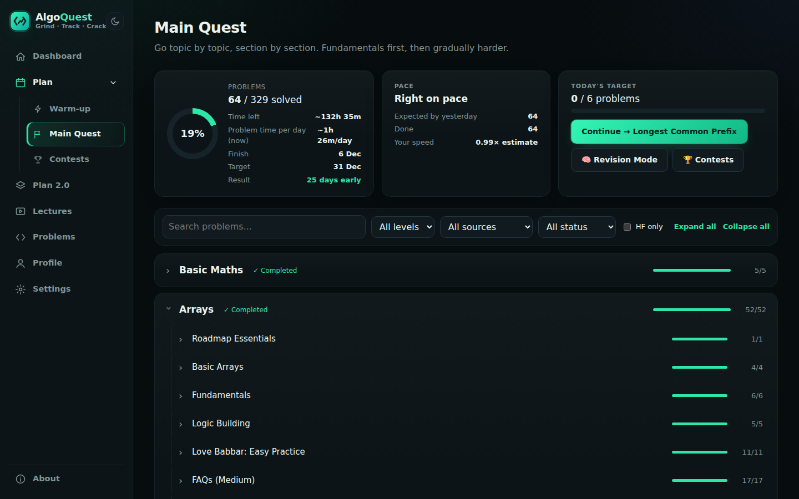
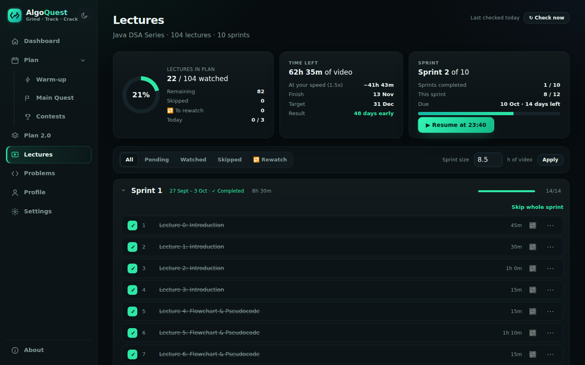
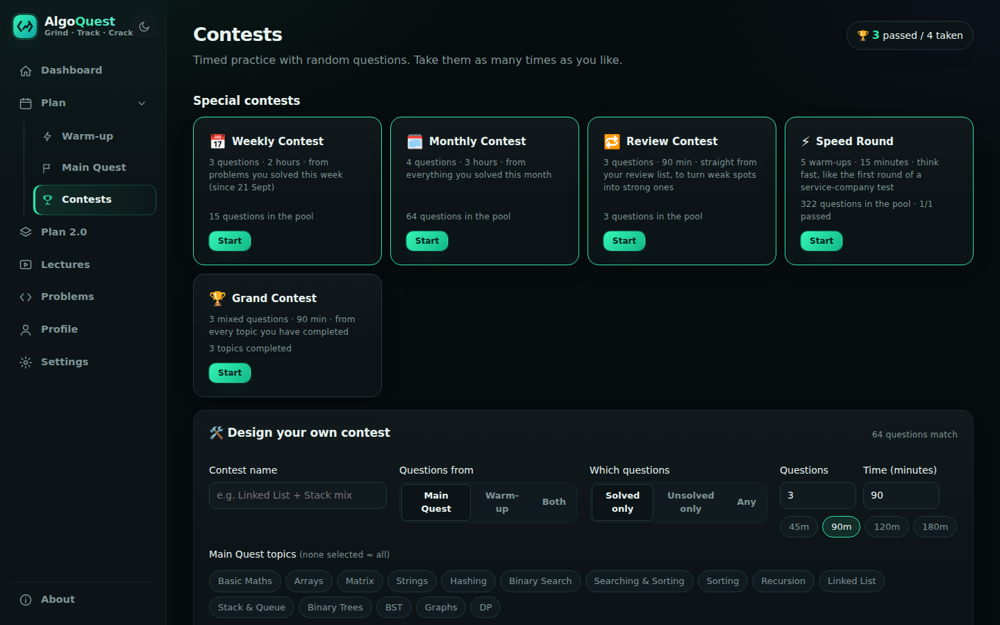
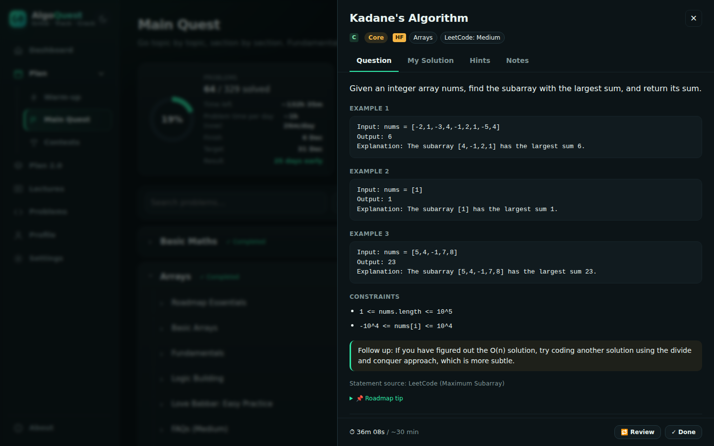
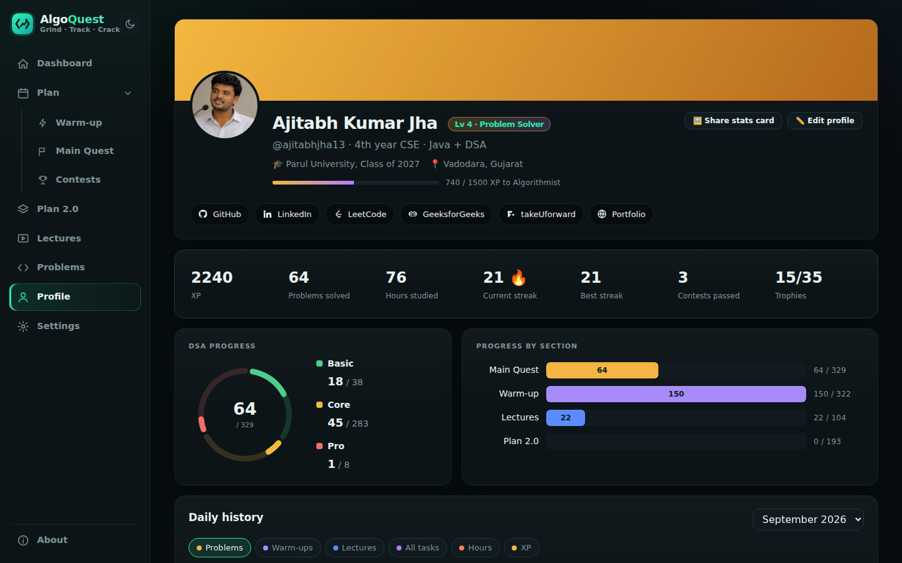
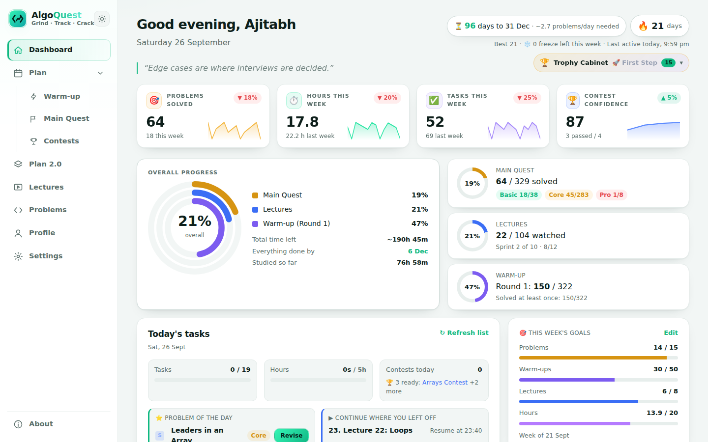
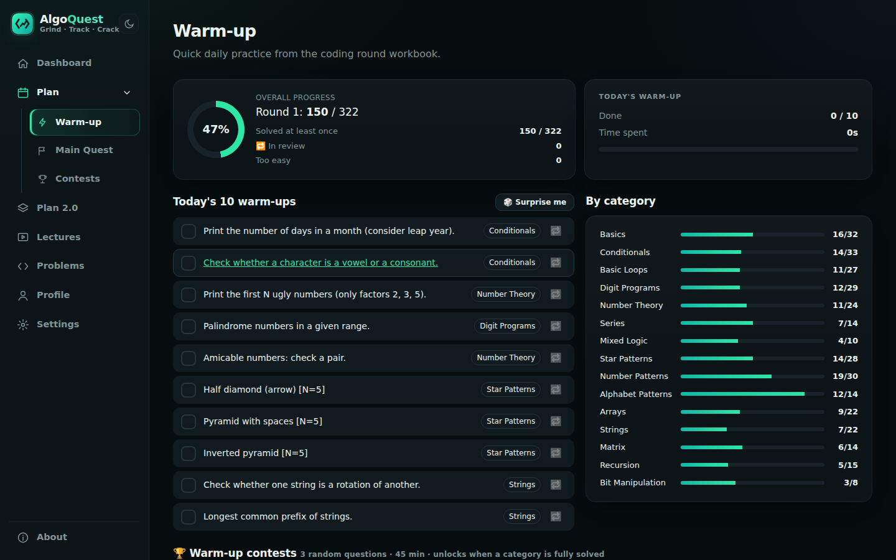
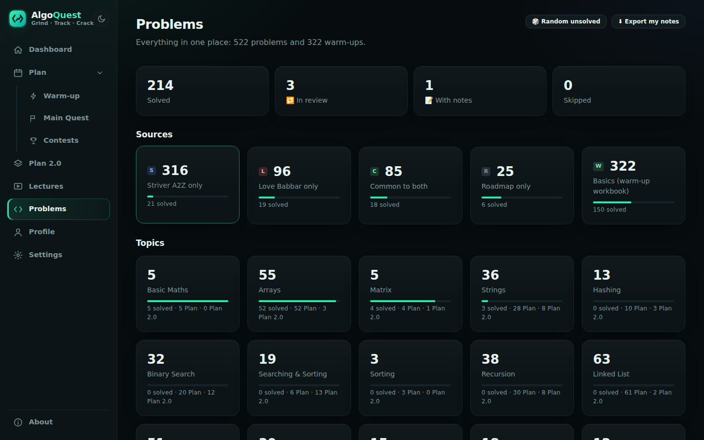
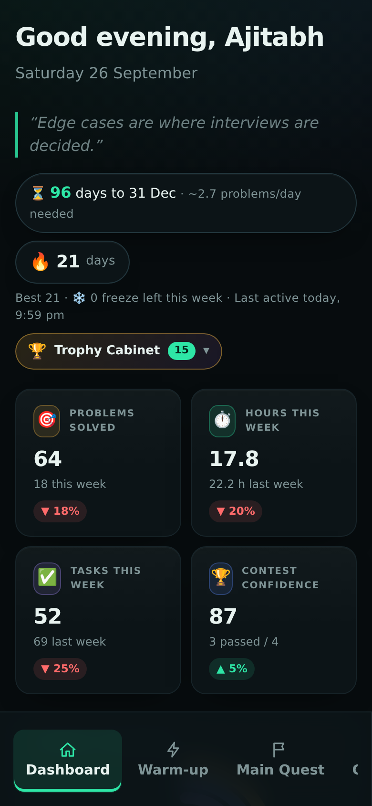

<div align="center">

# 🧭 AlgoQuest

### Grind · Track · Crack

**A personal DSA planner that turns lectures, warm-ups and problems into a day-by-day plan, and keeps me honest until placement day.**

[](https://ajitabhjha13.github.io/dsa-planner/)




</div>

---

## 💡 Why I built it

I tried learning DSA from YouTube many times, and every time I ended up restarting from zero. What was missing was never motivation. It was **structure**: a plan for the day, a way to see progress, and something that kept me honest.

Paid planners gave me that structure, but they were too expensive for me as a student. So I built my own. AlgoQuest knows how many hours I can study, splits my syllabus into real days, times every problem, remembers what I got wrong, and shows me exactly how close I am to being placement-ready by **December 2026**.

I started building it on **25 September 2026** and started practising with it on **27 September 2026**. I use it every day.

---

## ✨ Features

### 🧭 A plan that knows your hours
- Set your study hours for each day of the week, a start date and a target date.
- A **greedy scheduler** places every warm-up, problem and lecture on a real calendar.
- Miss a day? The plan re-shapes itself automatically and shows the new finish date.
- **Smart estimates**: after 15 timed problems, it learns whether you are faster or slower than the estimates and adjusts the whole plan.

### 🎯 Three tracks, one goal
| Track | What it is |
|---|---|
| ⚡ **Warm-up** | 322 coding-round questions (basics, loops, patterns, arrays, strings). 10 a day, in shuffled rounds, with a Review Round for the ones you mark 🔁 |
| 🚩 **Main Quest** | 329 core problems for 6-8 LPA roles from **Striver's A2Z sheet**, **Love Babbar's sheet** and a curated roadmap, de-duplicated and arranged topic → section → problem |
| 🎬 **Lectures** | A YouTube playlist imported with the YouTube Data API, split into weekly **sprints**, with resume-from-timestamp |

Plus **Plan 2.0** with 193 advanced problems for after placements.

### 🧠 A question panel for every problem
- Full LeetCode statements, examples and constraints for 166 problems.
- Your own solution (hidden until you want to see it), step-by-step hints, key points and notes.
- Timer, "solved on my own / with help", and one-click review marking.

### 🏆 Contests that feel real
- Topic, Weekly, Monthly, Review, Speed Round and Grand contests, plus a **custom contest designer**.
- **Focus mode** pauses the rest of the app, **no-peeking** hides your notes, and **Blind mode** hides topic names like a real interview.
- Every contest updates a **confidence meter** and its history graph.

### 📈 Honest progress
- Dashboard with KPI sparklines, combined progress rings, today's tasks, Problem of the Day and "continue where you left off".
- Streaks with a weekly **❄️ freeze**, a month activity calendar and a year heatmap.
- Topic **mastery levels**, **weak-area detection**, 35 **achievements** with rarities, and a trophy cabinet.

### 🎨 Polished UI
- Dark, light and system themes, smooth page transitions, skeleton loaders and a mobile layout.

---

## 📸 Screenshots

> Screenshots use demo data.

| Main Quest | Lectures |
|---|---|
|  |  |

| Contests | Question panel |
|---|---|
|  |  |

| Profile | Light mode |
|---|---|
|  |  |

| Warm-up | Problems library |
|---|---|
|  |  |

<p align="center"></p>

---

## ⚙️ How the scheduler works

The heart of AlgoQuest is a **greedy day-filling scheduler** (`js/scheduler.js`):

1. Every pending item gets a time estimate: problems by topic and difficulty, lectures by `video length ÷ playback speed × study multiplier`, warm-ups at 5 minutes each.
2. Starting from today, each day's capacity is `hours for that weekday × 60` minutes.
3. Warm-ups are placed first. The remaining time is split between lectures and Main Quest using a configurable share, and each track is filled **in order** until its budget runs out.
4. When one track finishes, its time goes to the other. When everything is placed, the last day is the projected finish date.

Because the plan is always rebuilt from **today**, a missed day needs no special handling: pending work simply shifts forward. Today's list is "locked" once generated, so ticking a task never reshuffles the day.

Other small algorithms inside:
- **Fisher–Yates shuffle** with balanced buckets for warm-up rounds.
- **Weighted random selection** (easy → medium → hard) for contest questions, avoiding the last attempt's questions.
- **Median-ratio speed factor** to calibrate estimates from real timer data.
- **Catmull–Rom curves** for the smooth charts, drawn as plain SVG.

---

## 🛠️ Tech stack

| Layer | Choice | Why |
|---|---|---|
| UI | HTML, CSS (custom design tokens), Vanilla JavaScript | No framework, so every line is mine to explain |
| Routing | Hash-based single-page app | Works on any static host |
| Storage | `localStorage` with JSON backup / restore | Private, free, offline |
| Data | Striver A2Z, Love Babbar 450, LeetCode dataset, YouTube Data API v3 | Real content, de-duplicated |
| Charts | Hand-written SVG | No chart library needed |
| Next | Spring Boot + MySQL + login | Sync across devices |

---

## 📁 Project structure

```
dsa-planner/
├── index.html            # App shell: sidebar + main area
├── css/style.css         # Design tokens, themes, components, animations
├── data/
│   ├── problems.json     # 522 problems with source, topic, tier, estimate
│   ├── workbook.json     # 322 warm-up questions
│   └── statements.json   # 166 LeetCode statements
├── js/
│   ├── store.js          # State + localStorage + backup
│   ├── scheduler.js      # Greedy day-by-day planner
│   ├── tracker.js        # Done / timer / streaks / daily log
│   ├── warmup.js         # Shuffle-bag rounds + review rounds
│   ├── contest.js        # Contest engine
│   ├── insights.js       # Mastery, weak areas, achievements
│   ├── analytics.js      # Profile charts, XP, reports
│   ├── youtube.js        # Playlist import + auto-check
│   ├── panel.js          # Shared question panel
│   ├── router.js         # Routing, theme, transitions
│   └── pages/            # One file per page
├── assets/               # Photo and signature for the About page
└── docs/                 # README screenshots
```

---

## 🚀 Run it locally

```bash
git clone https://github.com/Ajitabhjha13/dsa-planner.git
cd dsa-planner
```

Open the folder in VS Code and start **Live Server** (right-click `index.html` → *Open with Live Server*). The app must be served over HTTP because it loads JSON data files.

**To import lectures:** create a free YouTube Data API v3 key in Google Cloud, restrict it to your site's address, then paste it on the Lectures page. The key is stored only in your browser and is never included in backups or the repository.

---

## 🔒 Privacy

All progress lives in your own browser's `localStorage`. There is no account, no tracking and no server (yet). Use **Settings → Download backup** regularly, and **Restore backup** to move your progress to another browser.

---

## 🗺️ Roadmap

- [x] Planner, scheduler and three tracks
- [x] Contests, analytics, achievements
- [x] UI makeover with light mode
- [ ] Spring Boot + MySQL backend with login
- [ ] Sync across phone and laptop
- [ ] Installable app (PWA) with offline support

---

<div align="center">

### 👤 Author

**Ajitabh Kumar Jha**<br>
4th year CSE · Parul University · Vadodara, Gujarat

[](https://github.com/Ajitabhjha13)
[](https://www.linkedin.com/in/ajitabh-kumar-jha-476546283)
[](https://leetcode.com/u/ajitabhjha13/)
[](https://ajitabh-portfolio.vercel.app/)

<picture>
  <source media="(prefers-color-scheme: dark)" srcset="docs/signature-white.png">
  
</picture>

*Designed, built and used by me. Made with patience, chai and a lot of late nights.* ☕

</div>
