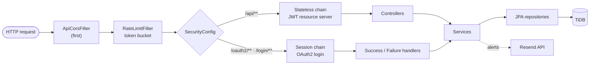

<div align="center">

# ☕ AlgoQuest API

**The Spring Boot backend behind [AlgoQuest](../README.md): owner-only sign-in, JWT sessions and conflict-safe cloud sync.**

[](https://algoquest-api-45ay.onrender.com/api/hello)


</div>

---

## 📌 What it does

- **Sign in with GitHub or Google** (OAuth 2.0). No passwords. Both providers link to one owner account; everyone else is politely turned away.
- **JWT sessions**: 7-day tokens that renew while the site is in use, a 60-day absolute limit, and *log out everywhere*.
- **Cloud sync** of the planner state with optimistic locking, idempotent saves and the last 10 versions (restore is undoable).
- **Security log and alerts**: every sign-in attempt is recorded; new devices and blocked attempts trigger an email.
- **Rate limiting** with a token bucket per client IP.

---

## 🧱 Architecture



| Package | Contents |
|---|---|
| `config` | `AppProperties` (owner, frontend URL, JWT, mail) as a typed record |
| `controller` | `MeController`, `SyncController`, `LoginHistoryController`, `HelloController` |
| `model` | `User`, `LoginEvent`, `UserState`, `StateSnapshot` |
| `repository` | Spring Data JPA repositories with projections and a revision-checked update |
| `security` | `SecurityConfig` (two chains), `JwtService`, `GithubUserService`, `GoogleUserService`, login handlers, `ApiCorsFilter`, `RateLimitFilter`, `ClientIp` |
| `service` | `SyncService`, `OwnerAccountService`, `LoginAuditService`, `SecurityAlertService`, `AlertMailService` |

**Tables:** `users`, `login_events`, `user_state` (one row per user, `LONGTEXT` data + `revision`), `state_snapshots` (last 10 versions).

---

## 🔌 Endpoints

| Method | Path | Auth | Description |
|---|---|---|---|
| `GET` | `/api/hello` | – | Liveness message |
| `GET` | `/actuator/health` | – | Health check (used by Render and the keep-alive) |
| `GET` | `/oauth2/authorization/{github\|google}` | – | Starts sign-in |
| `GET` | `/api/me` | JWT | Profile, linked providers, token expiry, session end |
| `POST` | `/api/auth/refresh` | JWT | New token (`403 reauth_required` after 60 days) |
| `POST` | `/api/auth/logout-all` | JWT | Revokes every token (bumps `token_version`) |
| `GET` | `/api/auth/history` | JWT | Last 20 sign-in attempts |
| `GET` | `/api/sync` | JWT | Full planner state + revision |
| `PUT` | `/api/sync` | JWT | Save `{ baseRevision, data }` · `409` on conflict · `413` above 2 MB |
| `GET` | `/api/sync/meta` | JWT | Revision only (cheap check before a save) |
| `GET` | `/api/sync/snapshots` | JWT | Last 10 versions |
| `POST` | `/api/sync/snapshots/{rev}/restore` | JWT | Restore a version as a new save |

### Example: a conflict-safe save

```http
PUT /api/sync
Authorization: Bearer <jwt>
Content-Type: application/json

{ "baseRevision": 41, "data": { "...": "planner state" } }
```

```jsonc
// 200 OK: saved as revision 42 (identical data returns the current revision, no new version)
{ "revision": 42, "updatedAt": "2026-10-20T12:40:03Z" }

// 409 Conflict: another device saved first
{ "error": "conflict", "serverRevision": 42 }
```

---

## ⚙️ Configuration

Local secrets live in `secrets.properties` (git-ignored, see `secrets.properties.example`). In production the same keys are Render environment variables.

| Key | Purpose |
|---|---|
| `DB_URL`, `DB_USER`, `DB_PASSWORD` | TiDB / MySQL connection (TLS) |
| `GITHUB_CLIENT_ID`, `GITHUB_CLIENT_SECRET` | GitHub OAuth app |
| `GOOGLE_CLIENT_ID`, `GOOGLE_CLIENT_SECRET` | Google OAuth client |
| `JWT_SECRET` | Base64, 48 random bytes, signs the HS256 tokens |
| `RESEND_API_KEY` | Alert emails (optional: emails are skipped if empty) |
| `ALGOQUEST_FRONTENDURL` | Where to send users after sign-in (production: `https://ajitabhjha13.github.io/algoquest`) |

---

## 🚀 Run locally

```bash
cp secrets.properties.example secrets.properties   # fill in the values
./mvnw spring-boot:run                               # Windows: .\mvnw.cmd spring-boot:run
```
API on `http://localhost:8080`, website on `http://localhost:5500/frontend/` (Live Server from the repo root).

Build the production JAR: `./mvnw clean package -DskipTests`

---

## 🐳 Deploy (Render)

The multi-stage `Dockerfile` builds with Maven, then runs the fat JAR on a slim Java 21 JRE tuned for 512 MB (`MaxRAMPercentage=75`, Serial GC) and binds to Render's `PORT`.

| Render setting | Value |
|---|---|
| Root directory | `backend` |
| Runtime | Docker |
| Region | Singapore (same as the database) |
| Health check path | `/actuator/health` |
| Auto-deploy | On commit (only changes inside `backend/`) |
